<!-- HEADER -->
<div align="center">
  

  
</div>

<div align="center">
  <a href="https://www.linkedin.com/in/majdh314">
    
  </a>
  <a href="mailto:majd3.14h@gmail.com">
    
  </a>
  
</div>

<br />


---

## 👤 About Me

```yaml
name:        "Majd Hussein"
role:        "Full Stack Developer Trainee"
training:    "HackYourFuture — Full Stack Specialization"
background:  "Chemical Engineering"
seeking:     "Junior Full Stack or Front-End Roles"

strengths:
  - "Engineering-grade problem solving & systems thinking"
  - "Logic-first approach: consistent, predictable, well-reasoned code"
  - "High attention to detail — catching edge cases early"
  - "Clear, structured team communication"

mottos:
  - "There are 360°, so why stick to one? — Zaha Hadid"
```

---


## 🛠️ Tech Stack

<div align="center">

### 🌐 Frontend
<p>
  
</p>

### ⚙️ Backend
<p>
  
</p>

### 🧰 Tools
<p>
  
</p>

</div>

---

## 🎯 What I Bring

| Trait | Description |
|---|---|
| 🔍 **Engineering Problem Solving** | Multi-variable thinking trained me to find root causes fast |
| 🧠 **Deep Focus** | Built for complex, long-term tasks without losing precision |
| 🎨 **Creative Thinking** | Non-obvious solutions from unexpected angles |
| 📡 **Clear Communication** | Transparent, structured progress sharing |
| 🔧 **Logic-Based Systems** | Consistent, predictable, well-reasoned code |
| 🌱 **Adaptability** | Quickly absorbing new tools, libraries, and workflows |

---


<div align="center">
  
</div>